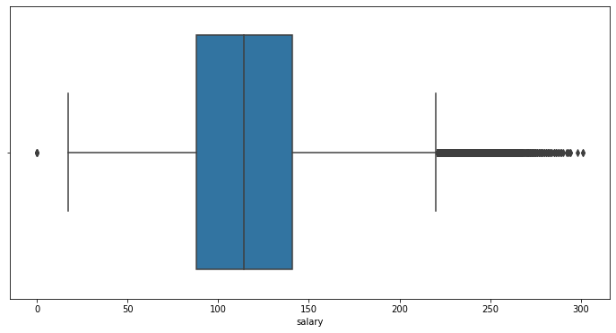
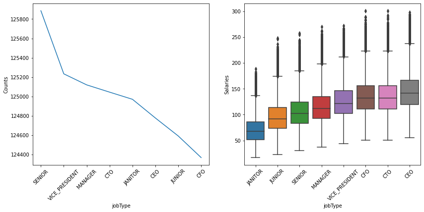
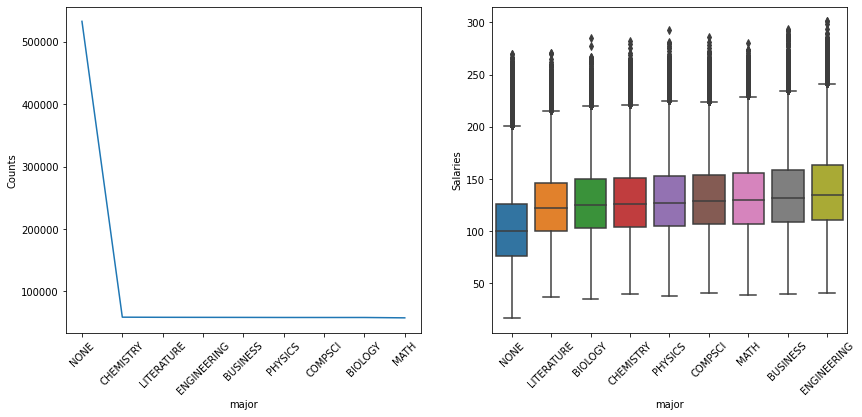
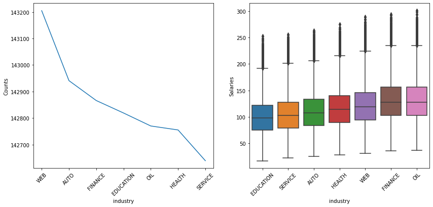
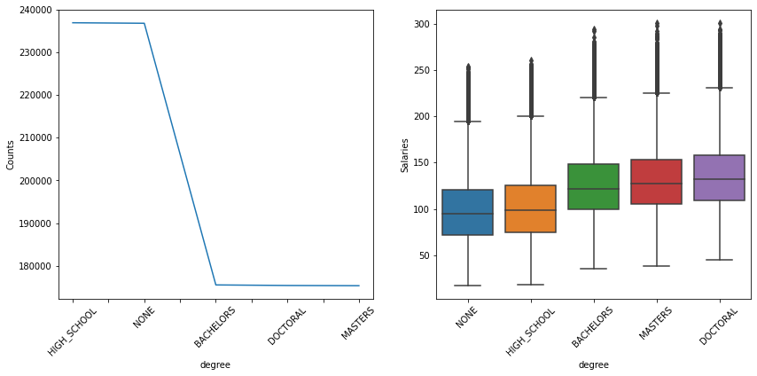
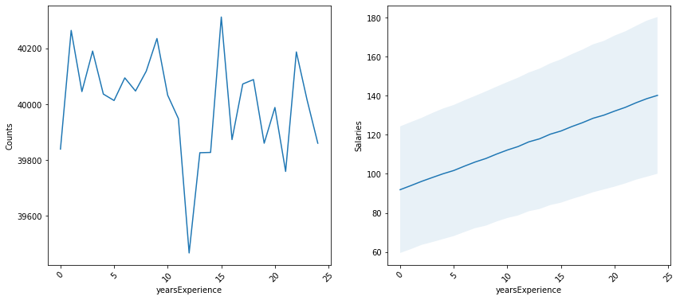
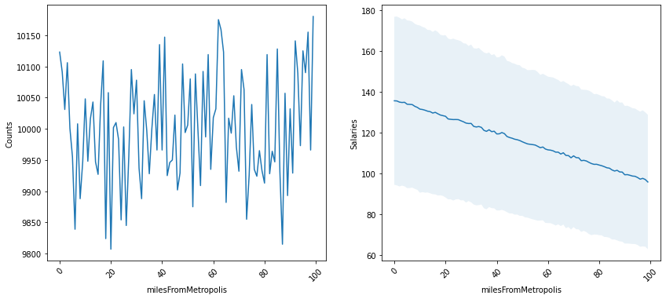
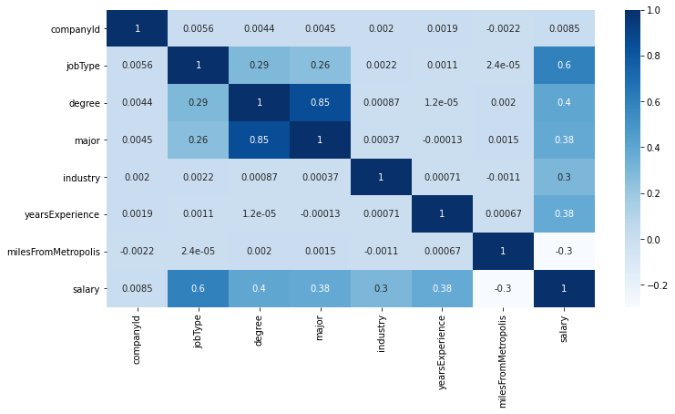
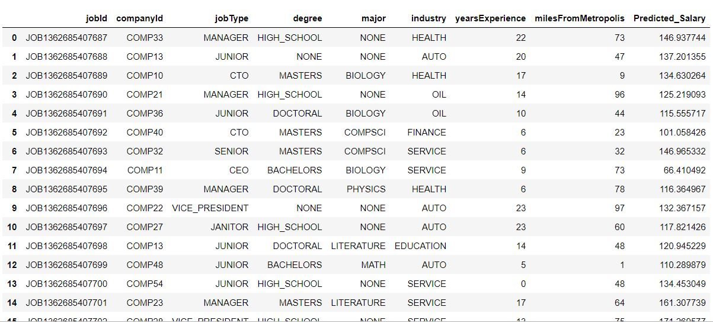

# Salary Prediction Project
The project predicts salaries for various jobs based on degree, major, industry, years of experience, miles from metropolis.

This is to help companies and job applicants estimate salaries for various jobs.

# Datasets
Datasets contain 1 million records.
train_features.csv is a training dataset and has 8 columns with the JobId as the unique ID.
train_salaries.csv is also a training dataset and has 2 columns - JobId and Salary
test_features.csv is the test dataset. It has 8 columns with the JobId as the unique ID.

Features of train_features.csv and test_features.csv
jobId - unique identifier for job
companyId  - unique identifier for company
jobType  - Job type
degree  - degree required for the job
major  - major required for the job
industry - industry for the job
yearsExperience - required years of experience
milesFromMetropolis - distance of the job location from the metropolis 

Features of train_salaries.csv
jobId - unique identifier for job
salary - job salary

## Outlier Detection
Salaries above 220.5 and below 8.5 were suspected to be outliers.

After analysis, it was observed that salaries above 220.5 where majorly from the Oil and Finance industries with several years of experience.
Records with salary below 8.5 were deleted as it wasn't logical to have such salaries except the jobs were volunteer jobs.

# Exploratory Data Analysis

A plot of average salaries by job type shows that there is some positive correlation between average salaries and job type. It is also logical to have janitors and juniors earn the lowest salaries while CEOs earn more than others.

A plot of average salaries by major shows that there is some positive correlation between average salaries and majors. It is logical for Engineering and business majors to earn more.

A plot of average salaries by industies show that there is some positive correlation between average salaries and industries. The oil and finance industries tend to earn higher salaries while the education industry earns the least.

A plot of average salaries by degree show that there is some positive correlation between average salaries and degree. The doctoral degree tends to earn higher and jobs that require no degree earn the lowest salaries.

A plot of average salaries by years of experience show that there is some strong positive correlation between the years of experience and average salaries. The more the years of experience required the more the salary.

A plot of average salaries by miles from metroplis show that there is some strong negative correlation between the miles from the metropolis and the average salaries. Jobs closer to the metropolis earn higher salaries while jobs farther from the metropolis earn less.

The heatmap shows there is a correlation between the jobType and salary. There is also a correlation between the major and degree and a strong negative correlation between milesFromMetropolis and salary

# Models
Models used in the project are Linear, Random Forest and XGBoost Regressor.

## MSE for each model using 5-fold cross validation
<table> 
    <tr>
        <th>Model</th>
        <th>Mean Square Error</th>
    </tr>
    <tr>
        <td>Linear Regressor</td>
        <td>384.4</td>
    </tr>
    <tr>
        <td>Random Forest Regressor</td>
        <td>365.7</td>
    </tr>
        <tr>
        <td>XGBoost Regressor</td>
        <td>358.4</td>
    </tr>   
</table>

## XGBoot Regressor was applied to the test data

